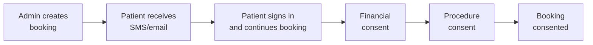

In-Practice bookings are created and scheduled by admin staff. The patient completes their part (financial and procedure consent) but you control the appointment type and time.

## Overview

---

## Step 1: Create the booking

1. Click **+ Create Booking** (in the nav or on the [Bookings](https://admin.opsync.com.au/bookings) page)
2. Enter patient details:
   - Name, email, mobile number, date of birth
   - Gender
   - Medicare number and IRN
   - Postcode
   - Funding arrangement (bulk billing, self fund, or private health fund)
3. Enter procedure details:
   - Specialist
   - Location
   - Procedure type
   - Date
   - Arrival time (optional)
4. Click **Create Booking**

<Note>Once created, the booking will have the status **Confirmed**.</Note>

---

## Step 2: Patient receives SMS and email

Patient receives an SMS and email with a link to the booking portal.

**SMS:**
> Welcome James to OpSync! Your account has been created. Please log in using this link: https://portal.opsync.com.au/sydney-gastro/signin?prefillPhone=0401000111

**Email:**

---

## Step 3: Patient completes financial consent

1. Patient signs in with their mobile number
2. Reviews the steps to complete
3. Reviews costs and signs financial consent

<Note>A PDF is automatically generated and attached to the booking. [View example consent PDF](/files/Example%20Consent.pdf)</Note>

<Note>Patient can continue now or pause and return later.</Note>

Once financial consent is complete, the patient receives an email with instructions for procedure consent:

---

## Step 4: Patient completes procedure consent

1. Patient watches procedure videos
2. Answers understanding questions

<Note>Patients must watch the entire video before proceeding — they cannot skip ahead.</Note>

---

## Step 5: Booking complete

The booking is now complete and ready for the procedure.

Patient and admin receive a confirmation email with procedure details and preparation instructions:

---

## Statuses

| Status | When |
|--------|------|
| **Confirmed** | Admin creates the booking |
| **Consented** | Patient completes both consents (done) |

